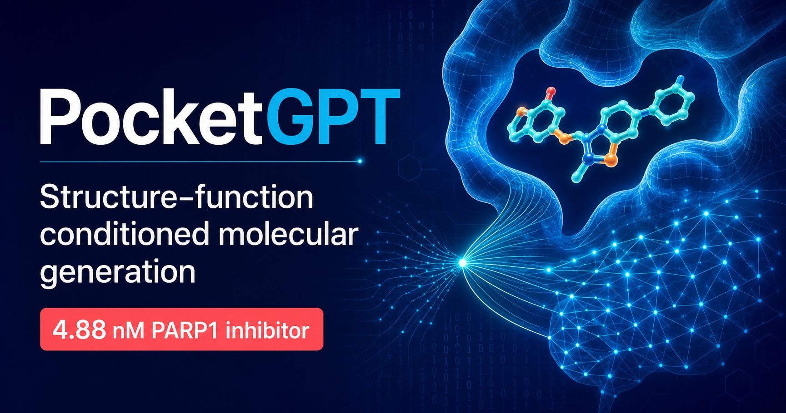

# PocketGPT Project Page



This repository contains the official project page for:

> **Structure–function conditioned molecular generation with PocketGPT enables prospective discovery of PARP1 inhibitors**

PocketGPT is a structure-aware molecular generation framework that jointly conditions protein pocket context and medicinal-chemistry objectives. It combines pocket embeddings, physicochemical property targets, fragment priors, and protein–ligand interaction fingerprints within a unified autoregressive model.

## Links

- **Project page:** [https://qianrong0709.github.io/PocketGPT_Page/](https://qianrong0709.github.io/PocketGPT_Page/)
- **Paper:** [https://doi.org/10.59717/j.xinn-drugdisc.2026.100028](https://doi.org/10.59717/j.xinn-drugdisc.2026.100028)
- **Code and data:** [https://github.com/qianrong0709/PocketGPT](https://github.com/qianrong0709/PocketGPT)

## Highlights

- Composable molecular generation conditioned on protein pockets, molecular properties, fragment priors, and interaction fingerprints.
- Structure-aware generation without explicit construction of three-dimensional ligand coordinates.
- Evaluation across 100 held-out protein targets.
- A prospective PARP1 design–make–test campaign identified Compound 2 with a measured binding affinity of **4.88 nM**.
- Compound 2 showed strong PARP1-over-PARP2 selectivity and favorable preliminary tolerability in mice.

## Project-page development

Install dependencies:

```bash
pnpm install
```

Run the local GitHub Pages version:

```bash
pnpm run build:pages
pnpm run preview:pages
```

The static site is generated in `dist-pages/`. Pushes to the `main` branch trigger the deployment workflow in `.github/workflows/deploy-pages.yml`.

## Citation

```bibtex
@article{qian2026pocketgpt,
  title   = {Structure--function conditioned molecular generation with PocketGPT enables prospective discovery of PARP1 inhibitors},
  author  = {Qian, Rong and Duan, Jilong and Liu, Xiaoping and Wang, Wenxuan and Zhu, Tingfei and Jiang, Dejun and Liu, Jin and Deng, Youchao and Lyu, Aiping and Cao, Dongsheng},
  journal = {The Innovation Drug Discovery},
  volume  = {1},
  number  = {2},
  pages   = {100028},
  year    = {2026},
  doi     = {10.59717/j.xinn-drugdisc.2026.100028}
}
```

## License

The article and the figures reproduced on this project page are available under the [Creative Commons Attribution 4.0 International License](https://creativecommons.org/licenses/by/4.0/).
